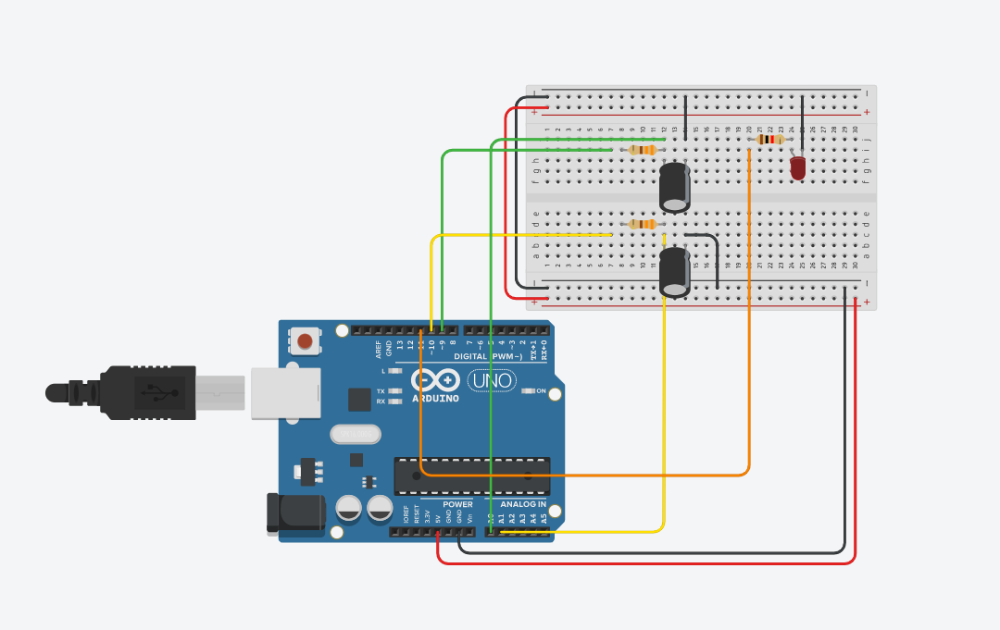

# Arduino IR sensor with modulation

Default speed for PWM is 490Hz on pins 9 and 10 (Timer1). This was too slow to have any effect (sensing loop is quicker, than one PWM cycle). So it had to be changed to 3906 Hz.

Modulating frequency is set to 100 Hz, maybe it could be set higher, but be beware of antialiassing.

Offset function was not tested at all.

Code is tested for this schema with exception of Arduino Pro Micro instead of Arduino UNO (uses same MCU - Atmega328p):

